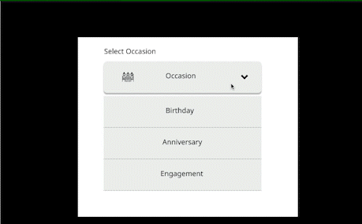
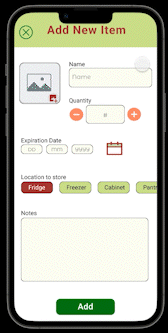

<h2 align="center">UX Design Projects</h2>

This repository contains a list of my UX Design projects in Figma!

The image above shows the creation of an copy of the AllTrails app on iOS.
Can you recognize which is the image from the original app and which is the copied version in Figma?

  
This is an interactive Dropdown Menu component which I created to embed in my prototypes.

  
As part of my UX Design coursework at Seattle University, I developed a mobile app experience for inventory tracking.
This prototype demonstrates how to add a new item to the inventory.

 
  <b> Thank you for stopping by 🤗</b>

