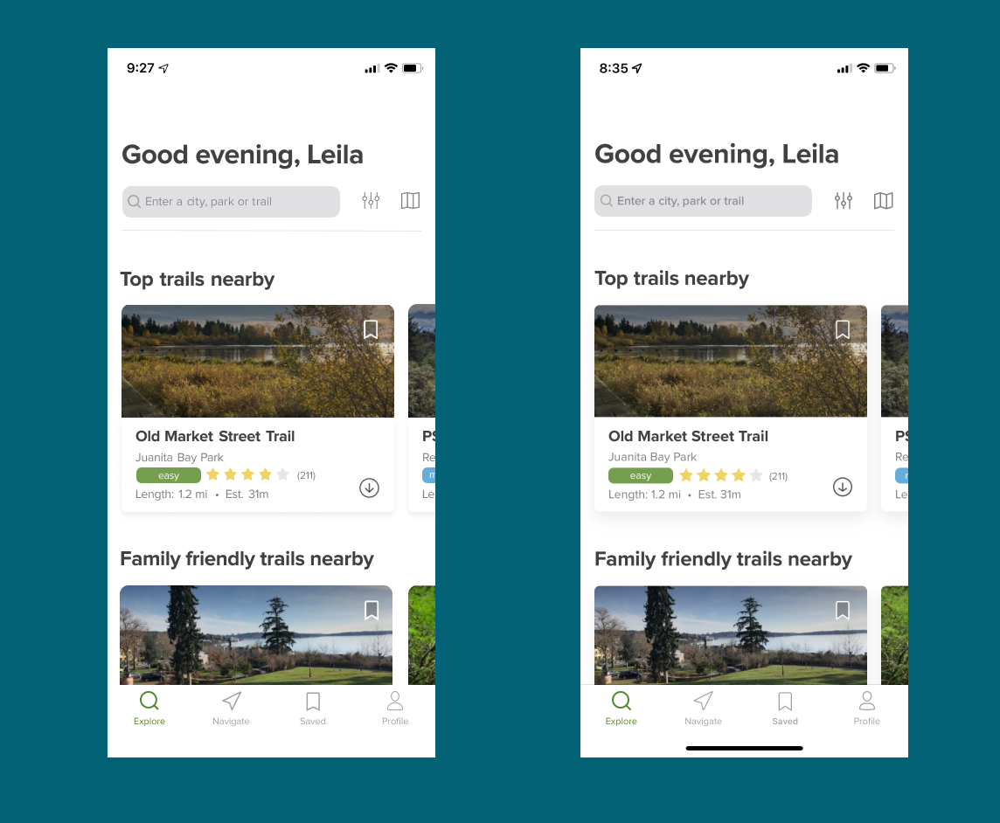

<h2 align="center">UX Design Projects</h2>

This repository contains a list of my UX Design projects in Figma!

The image above shows the creation of an copy of the AllTrails app on iOS.

Can you recognize which is the image from the original app and which is the copied version in Figma?

 
  <b> Thank you for stopping by 🤗</b>

